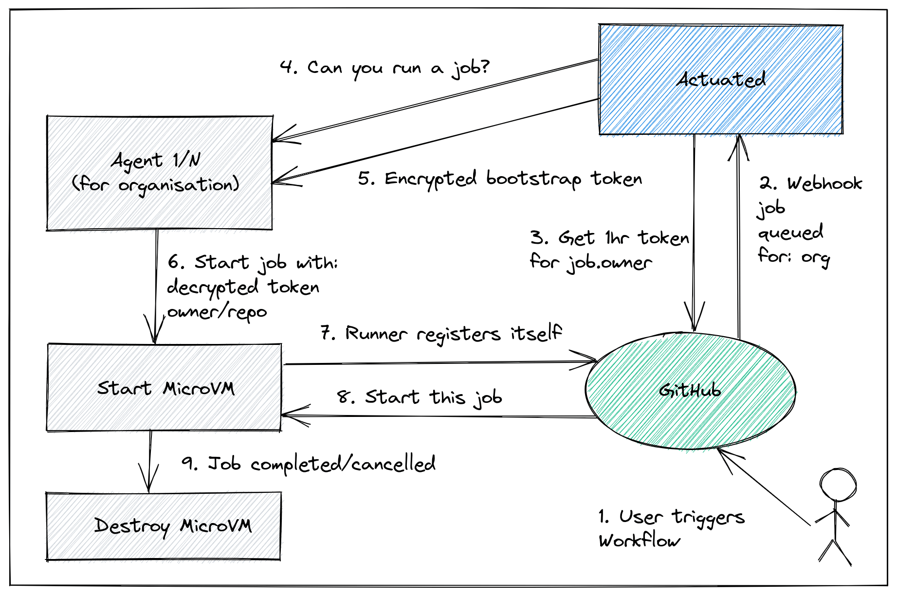

# Frequently Asked Questions (FAQ)

## How does it work?

Actuated has three main parts:

1. an agent which knows how to run VMs, you install this on your hosts
2. a VM image and Kernel that we build which has everything required for Docker, KinD and K3s
3. a multi-tenant control plane that we host, which tells your agents to start VMs and register a runner on your GitHub organisation

The multi-tenant control plane is run and operated by OpenFaaS Ltd.

> The conceptual overview showing how a MicroVM is requested by the control plane.
 
A short-lived token is used to register each new runner, which has been encrypted with the public key of the agent. This ensures no other agent could use the token to bootstrap a token to the wrong organisation.

Learn more: [Self-hosted GitHub Actions API](https://docs.github.com/en/rest/actions/self-hosted-runners#create-a-registration-token-for-an-organization)

## What kind of machines do I need for the agent?

You'll need either: a bare-metal host (your own, AWS i3.metal or Equinix Metal), or a VM that supports nested virtualisation such as those provided by GCP and DigitalOcean.

## Who is actuated for?

actuated is primarily for software engineering teams who are currently using GitHub Actions. A GitHub organisation is required for installation, and runners are attached to individual repositories as required, to execute builds.

## When will Jenkins, GitLab CI, BitBucket Pipeline Runners, Drone or Azure DevOps be supported?

For the pilot phase, we're targeting GitHub Actions because it has fine-grained access controls and the ability to schedule exactly one build to a runner. Most other CI systems expect self-hosted runners to perform many builds, and we believe that to be an anti-pattern. We'll offer advice to teams accepted into the pilot who wish to evaluate GitHub Actions or migrate away from another solution.

That said, if you're using these tools within your organisation, and face similar issues or concerns, we'd like to hear from you.

Feel free to contact us at: [contact@openfaas.com](mailto:contact@openfaas.com)

## What kind of access is required to my GitHub Organisation?

GitHub Apps provide fine-grained privileges, access control, and event data.

Actuated integrates with GitHub using a [GitHub App](https://docs.github.com/en/developers/apps/getting-started-with-apps/about-apps).

The actuated GitHub App will request:

* Administrative access to add/remove GitHub Actions Runners to individual repositories
* Events via webhook for Workflow Runs and Workflow Jobs

## How many builds does a single actuated VM run?

When a VM starts up, it runs the GitHub Actions Runner ephemeral (aka one-shot) mode, so in can run at most one build. After that, the VM will be destroyed.

See also: [GitHub: ephemeral runners](https://docs.github.com/en/actions/hosting-your-own-runners/autoscaling-with-self-hosted-runners#using-ephemeral-runners-for-autoscaling)

## What's in the VM image and how is it built?

The VM image will be publicly available in a container registry for you to explore.

## Is ARM64 supported?

Yes, actuated is built to run on both Intel/AMD and ARM64 hosts, check your subscription plan to see if ARM64 is included.

## Is Actuated free and open-source?

Actuated is commercial software developed by OpenFaaS Ltd. A subscription will be required to use the software.

[Read the End User License Agreement (EULA)](https://github.com/self-actuated/actuated/blob/master/EULA.md)

The website and documentation are available on GitHub and we plan to release some open source tools in the future for actuated customers. 

## Is there a risk that we could get "locked-in" to actuated?

No, you can move back to hosted runners, or self-managed self-hosted runners at any time, but you may run into the problems that actuated sets out to solve.

## Why is the brand called "actuated" and "selfactuated"?

The name of the software is actuated, in some places "actuated" is not available, and we liked "selfactuated" more than "actuatedhq" or "actuatedio" because it refers to the hybrid experience of self-hosted runners.

## What do I need to change in my workflows?

Very little, just add / set `runs-on: actuated`

## Where can I find example GitHub Actions for Docker, KinD, K3s or OpenFaaS?

* [AMD64/Intel examples](https://github.com/actuated-samples)
* [AARCH64 / Graviton / Raspberry Pi 4 examples](https://github.com/actuated-samples-arm64)
